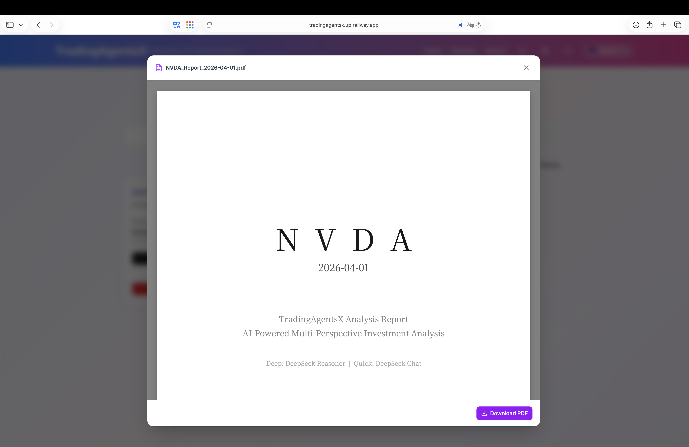

# TradingAgentsX - Multi-Agent Intelligent Trading Analysis System

<div align="center">


**An AI stock trading analysis platform based on LangGraph, combining multiple specialized AI agents for collaborative decision-making**

[](https://github.com/MarkLo127/TradingAgentsX)
[](https://www.python.org/)
[](https://nextjs.org/)
[](https://fastapi.tiangolo.com/)
[](LICENSE)

[](https://tradingagentsx.up.railway.app)

</div>

---

## 📖 Introduction

**TradingAgentsX** is an advanced multi-agent AI trading analysis system that simulates the operation of a real-world trading firm. By orchestrating multiple specialized AI agents (analysts, researchers, traders, and risk managers) via LangGraph, the system analyzes the stock market from different perspectives and generates high-quality trading decisions through a structured debate and collaboration process.

> 💡 **Acknowledgement**: This project is improved and extended based on [TauricResearch/TradingAgents](https://github.com/TauricResearch/TradingAgents).

### 🎯 Core Features

| Feature                      | Description                                                                  |
| ---------------------------- | ---------------------------------------------------------------------------- |
| 🤖 **Multi-Agent Architecture** | 12 specialized AI agents (analysts, researchers, traders, risk managers) working together |
| 🌐 **Multi-Model Support**   | LLM providers including OpenAI, Anthropic, Gemini, Grok, DeepSeek, Qwen, etc. |
| 🔒 **Google OAuth Login**    | Cloud-synced API settings and history reports, supporting multi-device sync  |
| 📊 **US & Taiwan Stock Support** | Full support for US stocks (Yahoo Finance) and Taiwan stocks (FinMind) data |
| 🔑 **BYOK Mode**             | Users bring their own API keys; encrypted storage on the frontend for privacy |
| 🛡️ **Security**              | Rate Limiting, Security Headers, API Key masking                             |
| 📱 **Responsive Design**     | Supports desktop and mobile browsers                                         |
| 🐳 **Docker Deployment**     | One-command startup for frontend and backend services                        |
| 🧠 **Embeddings Model Choice** | Supports sentence-transformers (local, free) or OpenAI embeddings          |
| 💬 **AI Report Q&A**         | Supports AI-powered Q&A on analysis reports                                  |
| 📊 **PDF Preview**           | Supports PDF preview functionality                                           |
| 🌐 **Multi-language Support** | Supports Traditional Chinese and English                                    |

---

## 🏗️ System Architecture

```
TradingAgentsX/
├── frontend/                   # Next.js frontend application
│   ├── app/                    # App Router pages
│   │   ├── page.tsx            # Home page
│   │   ├── layout.tsx          # Root layout
│   │   ├── globals.css         # Global styles
│   │   ├── analysis/           # Analysis feature pages
│   │   ├── history/            # History report pages
│   │   ├── auth/               # OAuth callback
│   │   └── api/                # API routes (config, auth)
│   ├── components/             # React components
│   │   ├── AgentFlowDiagram.tsx    # Agent flow diagram component
│   │   ├── PendingTaskRecovery.tsx # Task recovery component
│   │   ├── analysis/           # Analysis-related components
│   │   ├── auth/               # Login button
│   │   ├── layout/             # Header, Footer
│   │   ├── settings/           # API settings dialog
│   │   ├── shared/             # Shared components
│   │   ├── theme/              # Theme-related components
│   │   └── ui/                 # shadcn/ui base components (16 total)
│   ├── contexts/               # React Context (auth state)
│   ├── hooks/                  # Custom Hooks
│   └── lib/                    # Utility functions
│       ├── api.ts              # API calls
│       ├── api-helpers.ts      # API helper functions
│       ├── crypto.ts           # Encryption utilities
│       ├── storage.ts          # Local storage
│       ├── reports-db.ts       # IndexedDB report storage
│       ├── pending-task.ts     # Pending task management
│       ├── user-api.ts         # User API
│       ├── types.ts            # TypeScript type definitions
│       └── utils.ts            # General utilities
│
├── backend/                    # FastAPI backend service
│   ├── __main__.py             # Application entry point
│   └── app/
│       ├── main.py             # FastAPI app (middleware, routes)
│       ├── api/                # API routes
│       │   ├── routes.py       # Analysis API
│       │   ├── auth.py         # Google OAuth
│       │   ├── user.py         # User data sync
│       │   └── dependencies.py # Dependency injection
│       ├── core/               # Core configuration
│       ├── db/                 # PostgreSQL database
│       ├── models/             # Pydantic models
│       └── services/           # Business logic
│           ├── trading_service.py  # Trading analysis service
│           ├── task_manager.py     # Task manager
│           ├── pdf_generator.py    # PDF report generation
│           ├── price_service.py    # Stock price data service
│           ├── download_service.py # Download service
│           ├── redis_client.py     # Redis client
│           └── auth_utils.py       # Authentication utilities
│
└── tradingagents/              # Core AI agent package
    ├── agents/                 # AI agent definitions
    │   ├── analysts/           # Analyst team
    │   │   ├── market_analyst.py       # Market analyst
    │   │   ├── news_analyst.py         # News analyst
    │   │   ├── social_media_analyst.py # Social media analyst
    │   │   └── fundamentals_analyst.py # Fundamentals analyst
    │   ├── researchers/        # Research team
    │   │   ├── bull_researcher.py      # Bull researcher
    │   │   └── bear_researcher.py      # Bear researcher
    │   ├── trader/             # Trader
    │   │   └── trader.py               # Trader agent
    │   ├── risk_mgmt/          # Risk management team
    │   │   ├── aggresive_debator.py    # Aggressive debator
    │   │   ├── conservative_debator.py # Conservative debator
    │   │   └── neutral_debator.py      # Neutral debator
    │   ├── managers/           # Manager decision-makers
    │   │   ├── research_manager.py     # Research manager
    │   │   └── risk_manager.py         # Risk manager
    │   └── utils/              # Agent utility functions
    ├── dataflows/              # Data acquisition and processing
    │   ├── interface.py        # Unified data interface
    │   ├── config.py           # Dataflow configuration
    │   ├── y_finance.py        # Yahoo Finance data
    │   ├── yfin_utils.py       # Yahoo Finance utilities
    │   ├── alpha_vantage*.py   # Alpha Vantage series (5 files)
    │   ├── finmind*.py         # FinMind Taiwan stock data (6 files)
    │   ├── google.py           # Google Search
    │   ├── googlenews_utils.py # Google News utilities
    │   ├── reddit_utils.py     # Reddit data
    │   ├── openai.py           # OpenAI embeddings
    │   └── retry_utils.py      # Retry utilities
    ├── graph/                  # LangGraph workflow
    │   ├── trading_graph.py    # Trading analysis graph
    │   ├── setup.py            # Graph setup
    │   ├── propagation.py      # State propagation
    │   ├── reflection.py       # Reflection mechanism
    │   ├── conditional_logic.py    # Conditional logic
    │   └── signal_processing.py    # Signal processing
    ├── utils/                  # General utilities
    └── default_config.py       # Default configuration
```

---

## 🤖 AI Agent Team

### Analyst Team (4 Agents)

| Agent                  | Role                  | Output                                              |
| ---------------------- | --------------------- | --------------------------------------------------- |
| Market Analyst         | Technical Analysis    | RSI, MACD, Bollinger Bands, Support/Resistance Levels |
| Social Media Analyst   | Sentiment Assessment  | Reddit/Twitter sentiment indicators, investor confidence |
| News Analyst           | News Analysis         | Latest news summaries, event impact assessment     |
| Fundamentals Analyst   | Financial Analysis    | Financial report data, P/E, P/B, profitability     |

### Research Team (3 Agents)

| Agent             | Role                                          |
| ----------------- | --------------------------------------------- |
| Bull Researcher   | Bullish argument development, upside catalyst analysis |
| Bear Researcher   | Bearish argument development, downside risk warnings  |
| Research Manager  | Integrated decision-making from bull and bear viewpoints |

### Trading & Risk Team (5 Agents)

| Agent                  | Role                                                |
| ---------------------- | --------------------------------------------------- |
| Trader                 | Integrates all reports to formulate a trading plan  |
| Aggressive Debator     | High-risk, high-reward strategy analysis            |
| Conservative Debator   | Prudent, conservative strategy and risk control     |
| Neutral Debator        | Neutral and balanced strategy assessment            |
| Risk Manager           | Comprehensive risk management decision and final recommendation |

---

## 🚀 Quick Start

### Prerequisites

- **Python** 3.10+
- **Node.js** 18.x+ or **Bun** 1.x+

### Required API Keys

| API                      | Purpose                    | Registration URL                                     |
| ------------------------ | -------------------------- | ---------------------------------------------------- |
| OpenAI                   | GPT models                 | https://platform.openai.com/api-keys                 |
| Alpha Vantage (optional) | US stock fundamental data  | https://www.alphavantage.co/support/#api-key         |
| FinMind (optional)       | Taiwan stock data          | https://finmindtrade.com/                            |

### Installation Steps

#### 1️⃣ Clone the Repository

```bash
git clone https://github.com/MarkLo127/TradingAgentsX.git
cd TradingAgentsX
```

#### 2️⃣ Backend Setup

```bash
# Create a virtual environment
conda create -n tradingagents python=3.13
conda activate tradingagents

# Install dependencies
pip install -e .
pip install -r backend/requirements.txt

# Configure environment variables
cp .env.example .env
# Edit .env and fill in your API keys

# Start the backend
python -m backend
```

Backend services:

- API: http://localhost:8000
- Swagger Docs: http://localhost:8000/docs

#### 3️⃣ Frontend Setup

```bash
# Install dependencies (run from the project root)
bun install --cwd frontend

# Start the development server
bun run --cwd frontend dev
```

Frontend application: http://localhost:3000

#### 4️⃣ Terminal UI (TUI, optional)

In addition to the web interface, you can run an analysis directly in your terminal. The TUI is built with [Textual](https://github.com/Textualize/textual) and is installed by `pip install -e .`.

```bash
# Make sure the backend setup is done and the virtual environment is active
conda activate tradingagents

# Launch the TUI
python -m tui.main
```

- On the config screen, choose the market, ticker, analyst team, LLM and embedding models; API keys can be left blank to fall back to the values in `.env`
- After pressing "Start Analysis", it shows real-time agent progress, messages/tool calls, and the current report
- The final decision (BUY / SELL / HOLD) is shown on completion; press `q` to quit

---

## 🐳 Docker Deployment

```bash
# Configure environment variables
cp .env.example .env

# Start services
docker compose up -d --build

# View logs
docker compose logs -f

# Stop services
docker compose down -v
```

Service ports:

- Backend: http://localhost:8000
- Frontend: http://localhost:3000

---

## 🔒 Security Features

### Local Development vs. Production Environment

| Feature              | Local Development (localhost) | Production (Railway, etc.)         |
| -------------------- | ----------------------------- | ---------------------------------- |
| Google Login         | Optional (not required)       | Recommended to enable              |
| Auto Data Clearing   | ❌ Data is not cleared         | ✅ Cleared on exit when not logged in |
| PostgreSQL           | Optional                      | Required                           |
| API Settings Storage | Persistent                    | Cloud-synced after login           |
| History Report Storage | Persistent                  | Cloud-synced after login           |

### Frontend Security

- **Encrypted API Key Storage** - Uses AES-GCM encryption for sensitive data in localStorage
- **Auto-Clearing (Production Only)** - Local data is automatically cleared when unauthenticated users leave the page
- **Safari Touch Optimization** - Fixes touch event issues on iOS Safari

### Backend Security

- **Rate Limiting** - 30 requests per minute limit
- **Security Headers** - X-Content-Type-Options, X-Frame-Options, etc.
- **Sensitive Data Masking** - API Keys are automatically masked in logs
- **CORS Configuration** - Restricts cross-origin request sources

### Cloud Sync

- **Google OAuth 2.0** - Secure third-party authentication
- **JWT Token** - Stateless authentication
- **Cloud Backup** - API settings and history reports synced to the server

---

## 📱 User Guide

### 1. Configure API Keys

Click the "Settings" button in the top-right corner and enter your API keys.

### 2. Select Analysis Parameters

- **Market Type**: US Stocks / Taiwan Listed Stocks / Taiwan OTC Stocks
- **Stock Ticker**: e.g., NVDA, 2330
- **Analyst Team**: Select the desired analysts
- **Research Depth**: Shallow (Fast) / Medium / Deep (Detailed)
- **LLM Models**: Quick-thinking model + Deep-thinking model

### 3. Run Analysis

Click "Run Analysis" and wait 1–5 minutes (depending on research depth).

### 4. View Results

- **Trading Decision Summary** - BUY / SELL / HOLD recommendation
- **Stock Price Chart** - Toggle between line chart and candlestick chart
- **12 Agent Reports** - Click tabs to view detailed analysis from each agent

### 5. Save and Download

- **Save Report** - Save locally or to the cloud
- **Download PDF Report** - Export a full PDF analysis report

### 📄 Sample Report

View a complete PDF analysis report example:

📥 **[AVGO Broadcom Inc. Analysis Report (2026-04-01)](report/en/AVGO_Report_2026-04-01.pdf)**

---

## 🔌 API Documentation

### Health Check

```bash
GET /api/health
```

### Run Analysis

```bash
POST /api/analyze
Content-Type: application/json

{
  "ticker": "NVDA",
  "market_type": "us",
  "analysis_date": "2024-01-15",
  "research_depth": 2,
  "analysts": ["market", "social", "news", "fundamentals"],
  "quick_think_llm": "gpt-5-mini",
  "deep_think_llm": "claude-sonnet-4-5",
  "quick_think_api_key": "sk-...",
  "deep_think_api_key": "sk-ant-...",
  "embedding_api_key": "sk-...",
  "alpha_vantage_api_key": "..."
}
```

### Query Task Status

```bash
GET /api/task/{task_id}
```

Full documentation: http://localhost:8000/docs

---

## 🛠️ Technology Stack

### Backend

| Technology           | Purpose                            |
| -------------------- | ---------------------------------- |
| FastAPI              | Async web framework                |
| LangGraph            | Multi-agent workflow orchestration |
| LangChain            | LLM application development        |
| ChromaDB             | Vector database (memory system)    |
| PostgreSQL           | User data storage                  |
| SQLAlchemy + asyncpg | Async database ORM                 |
| Pydantic             | Data validation                    |

### Frontend

| Technology   | Purpose                   |
| ------------ | ------------------------- |
| Next.js 16   | React full-stack framework |
| TypeScript   | Static typing             |
| Tailwind CSS | Styling framework         |
| shadcn/ui    | UI component library      |
| Dexie.js     | IndexedDB wrapper         |
| Recharts     | Data visualization        |

---

## 📸 Application Screenshots

### Home Page


---

### API Configuration Page


---

### Task Configuration Page


---

### Analysis History


---

### 12 Analyst Reports


---

### PDF Report Preview and Download



---

### AI Report Q&A


---

## 🙏 Acknowledgements

- [TauricResearch/TradingAgents](https://github.com/TauricResearch/TradingAgents) - Original project
- [LangChain](https://github.com/langchain-ai/langchain) - LLM application framework
- [LangGraph](https://github.com/langchain-ai/langgraph) - Multi-agent orchestration
- [FastAPI](https://github.com/tiangolo/fastapi) - Web framework
- [Next.js](https://github.com/vercel/next.js) - React framework
- [shadcn/ui](https://github.com/shadcn/ui) - UI component library

---

## 📄 License

This project is licensed under the Apache 2.0 License - see the [LICENSE](LICENSE) file for details.
